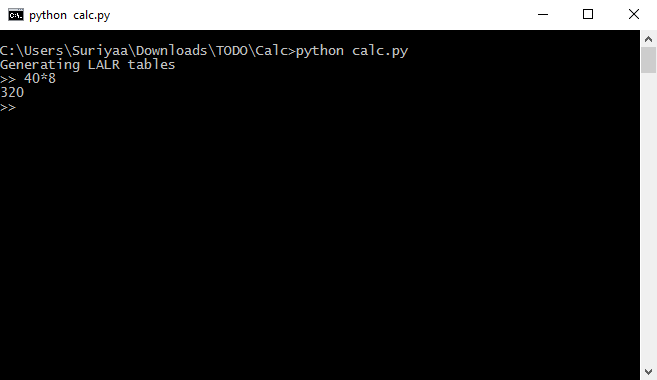

# PythonCalc [](https://travis-ci.org/Command-Line/pythoncalc)


<!-- Non-breaking space -->
&nbsp;

> This is the source code of the [The Command Line][org]'s Python Calculator created by [Suriyaa Kudo][creator].

<!-- Non-breaking space -->
&nbsp;


## Installation

### Requirements

```
pip install ply
```


## Screenshots



## Help

If you have any questions please [leave an issue][issue] or email [SuriyaaKudoIsc@users.noreply.github.com][mail].

[org]: https://github.com/Command-Line
[creator]: https://github.com/SuriyaaKudoIsc
[issue]: https://github.com/Command-Line/pythoncalc/issues
[mail]: mailto:SuriyaaKudoIsc@users.noreply.github.com
